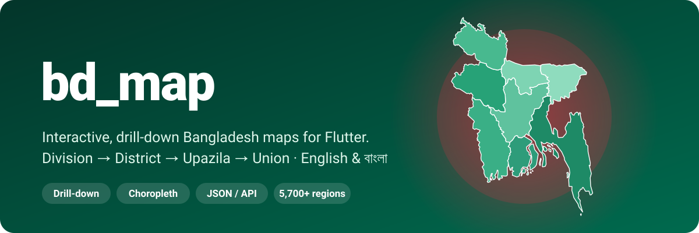
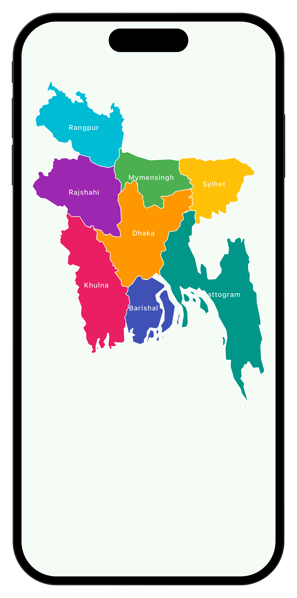
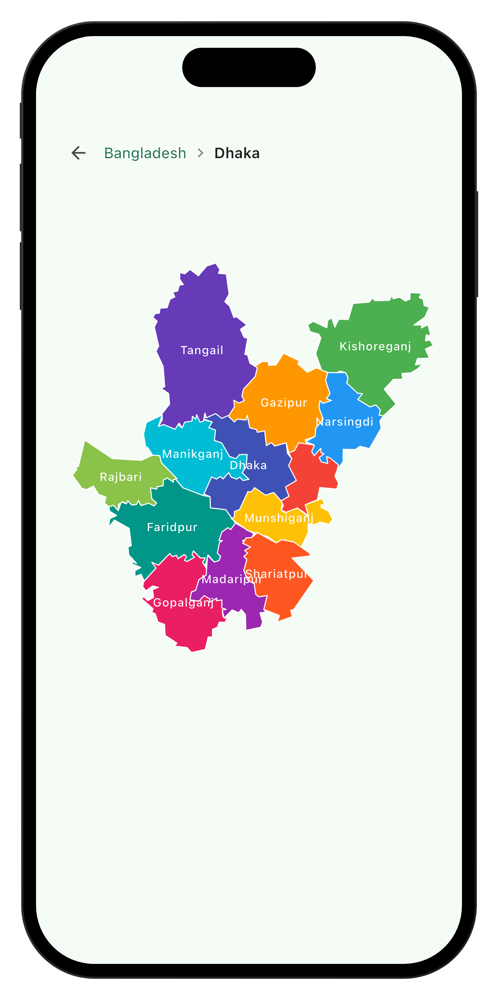
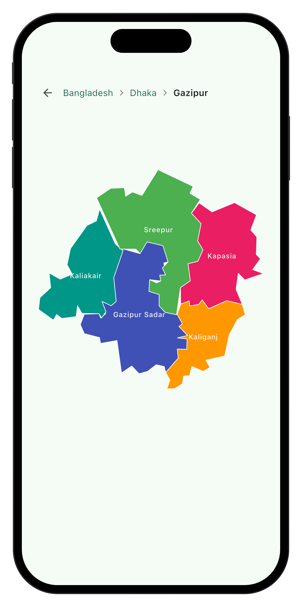
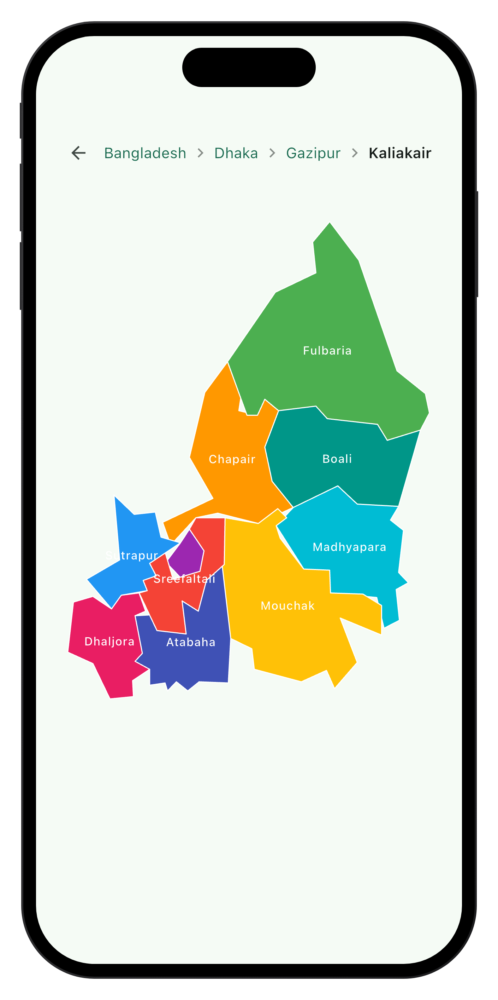
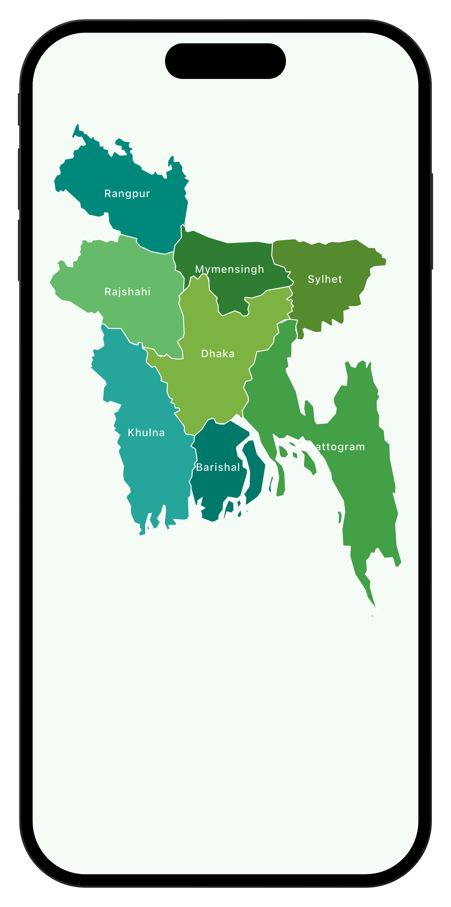
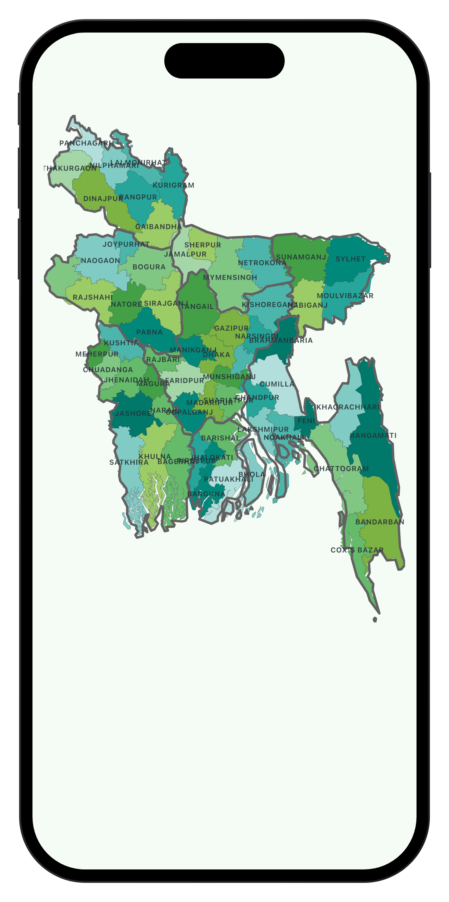
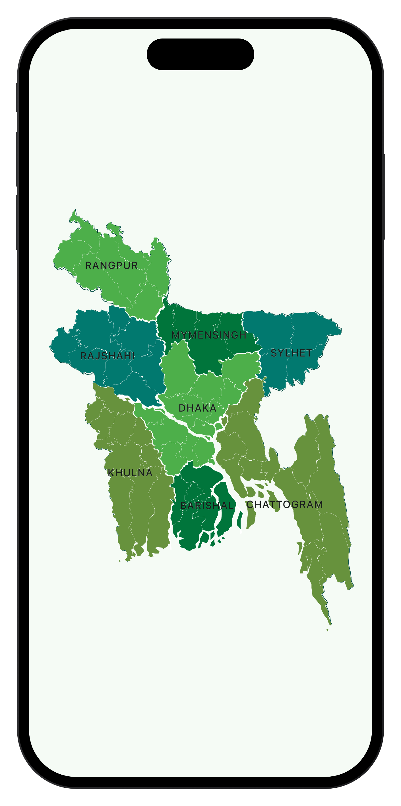

<p align="center">
  
</p>

[](https://pub.dev/packages/bd_map)
[](https://pub.dev/packages/bd_map/score)
[](https://github.com/farhansadikgalib/bd_map/blob/main/LICENSE)

Interactive Bangladesh maps for Flutter. One widget gives you a tappable map that drills from division down to union, with your own data from JSON or an API coloring every region. **Pure Dart, zero dependencies.**

## Screenshots

| Divisions | Districts | Upazilas | Unions |
| :---: | :---: | :---: | :---: |
|  |  |  |  |

## Installation

```sh
flutter pub add bd_map
```

```dart
import 'package:bd_map/bd_map.dart';
```

## Usage

### 1. Show a map

Every map works with no data at all. Pick the one you need:

```dart
BdMap()                         // tap to drill in, all four levels
BdCountryMap(BdArea.district)   // whole country at one level
Bangladesh()                    // classic division map
```

| `BdMap` | `BdCountryMap` | `Bangladesh` |
| :---: | :---: | :---: |
|  |  |  |

Switch labels, breadcrumb and panel text to Bangla with `useBanglaNames: true`.

### Features

| Feature | Widget or class | What you get |
| --- | --- | --- |
| Drill-down map | `BdMap` | Tap a division to see its districts, then upazilas, then unions. Breadcrumb, back button, animated zoom. |
| Wall maps | `BdCountryMap` | The whole country at one level: 8 divisions, 64 districts, 500+ upazilas or 5,100+ unions. Pinch to zoom, tap to select. |
| Your data | `BdMapData` | Load values from a JSON file, an API response or a Dart map. Shows in the info panel, a ranked list and, optionally, as choropleth colors. |
| Geography API | `BdGeo` | Every region with English and Bangla names, parent and children lookups, and boundary geometry. |
| Classic map | `BangladeshMap` | The original division map with per-division colors, tooltips and tap callbacks. |
| Pure Dart | | No assets, no plugins, no network. Everything is compiled into the package. |

### 2. Handle taps

Every callback and builder gives you a `BdRegion`:

```dart
BdMap(
  onRegionTap: (region) => print(region.name),
  infoBuilder: (context, region) => Text('${region.name} · ${region.bnName}'),
)
```

| Field | Example | Meaning |
| --- | --- | --- |
| `name` | `'Sreepur'` | English name |
| `bnName` | `'শ্রীপুর'` | Bangla name |
| `level` | `BdArea.upazila` | division, district, upazila or union |
| `id` | `'dhaka.gazipur.sreepur'` | Stable key: lowercase path from the division down |
| `parentId` | `'dhaka.gazipur'` | Id of the region one level up |

You never type ids by hand. Read them from a tapped region, look them up with `BdGeo`, or key your data by plain names in JSON as shown next.

### 3. Add your data

Write a JSON file nested the way the country is organized. Keys are region names in English or Bangla, each region has a `value`, and children sit inside their parent. A child that is a plain number is just its value:

```json
{
  "title": "Population",
  "unit": "M",
  "data": {
    "Dhaka": {
      "value": 44.2,
      "Gazipur": { "value": 3.4, "Sreepur": 0.4, "Kapasia": 1.3 },
      "Tangail": 4.0
    },
    "Sylhet": 11.0
  }
}
```

Load it and pass it to any map. The same line also accepts an API response body, where a JSON array of objects is read as a list:

```dart
final body = await rootBundle.loadString('assets/my_data.json');   // or (await http.get(uri)).body
final population = BdMapData<num>.fromJsonString(body);

BdMap(
  data: population,       // value shown in the info panel
  showDataList: true,     // ranked, tappable list under the map
)
```

API-style list items name their region with a level field and carry any numeric value field:

```json
[
  { "district": "Gazipur", "value": 3.4 },
  { "division": "Dhaka", "thana": "Savar", "population": 1.4 }
]
```

The maps keep their normal colors. For a choropleth, add one line:

```dart
regionColorBuilder: (r) => population.colorOf(r),
```

Building the dataset in Dart works too, keyed by region id:

```dart
final population = BdMapData<num>(
  {'dhaka': 44.2, 'dhaka.gazipur': 3.4, 'dhaka.gazipur.sreepur': 0.4},
  title: 'Population',
  format: (v) => '${v}M',
);
```

**Ready-made JSON files.** Copy one from [`example/assets`](example/assets), replace the sample values with yours, and every region name is already spelled correctly and in the right place:

| File | Contains |
| --- | --- |
| [`bd_data_full_country.json`](example/assets/bd_data_full_country.json) | All 5,700+ regions in one tree. Start here. |
| [`bd_data_divisions.json`](example/assets/bd_data_divisions.json) | 8 divisions |
| [`bd_data_districts.json`](example/assets/bd_data_districts.json) | 64 districts |
| [`bd_data_thanas.json`](example/assets/bd_data_thanas.json) | 544 thanas and upazilas |
| [`bd_data_unions.json`](example/assets/bd_data_unions.json) | 5,160 unions and wards |

The example app in [`example/lib/main.dart`](example/lib/main.dart) loads the full-country file and can switch to an API-style response from its app bar.

<details>
<summary>More data formats</summary>

Names are resolved among the parent's children only, so repeated names such as `Sadar` are never ambiguous. Children may also be wrapped in explicit `"districts"`, `"thanas"` or `"unions"` keys. A region carrying only children and no `"value"` is fine.

Flat per-level sections are accepted as well, with optional `Parent/Child` keys to disambiguate:

```json
{ "districts": { "Gazipur": 3.4 }, "upazilas": { "Gazipur/Sreepur": 0.4 } }
```

For API lists, the region comes from `division`, `district`, `thana` or `upazila`, and `union`, where the deepest field is the target and shallower ones qualify it, or from a generic `name`, `region` or `id`. The value comes from `value`, `count`, `total`, `amount`, `population` or `percentage`, otherwise the first numeric field. Name your own fields with `regionKey:` and `valueKey:` on `BdMapData.fromList`.

</details>

### 4. Show data as a list

`BdRegionDataList` renders a level or one region's children with the same colors and values as the maps:

```dart
BdRegionDataList(
  level: BdArea.district,             // all 64 districts, or
  // parent: BdGeo.divisionByName('Dhaka'),  // its 13 districts
  data: population,
  onTap: (region) => print(region.name),
)
```

### 5. Look up geography

```dart
final dhaka = BdGeo.divisionByName('Dhaka')!;      // or 'ঢাকা'
final districts = BdGeo.childrenOf(dhaka);          // 13 districts
final gazipur = BdGeo.districtByName('Gazipur')!;   // gazipur.id == 'dhaka.gazipur'
final upazilas = BdGeo.childrenOf(gazipur);         // its upazilas
final unions = BdGeo.unionsOf(upazilas.first.id);   // its unions
final region = BdGeo.byId('dhaka.gazipur.sreepur');
```

### `BdMap` options

| Parameter | Description |
| --- | --- |
| `maxLevel` | Deepest level the user can drill to. |
| `useBanglaNames` | Labels, breadcrumb and panel text in Bangla. |
| `data`, `showDataList` | Your `BdMapData` and the ranked list under the map. |
| `regionColorBuilder` | Per-region fill color, for choropleth maps. |
| `infoBuilder` | Your widget for the selected region in the info panel. |
| `onRegionTap`, `onLevelChanged` | Callbacks for taps and drilling in or out. |
| `palette`, `borderColor`, `borderWidth`, `labelTextStyle` | Styling. |
| `showLabels`, `showBreadcrumb`, `showInfoPanel` | Toggle built-in UI parts. |

Boundary geometry comes from [geoBoundaries](https://www.geoboundaries.org) (CC BY 4.0) and Bangla names from [bangladesh-geocode](https://github.com/nuhil/bangladesh-geocode), all compiled into Dart.

### Classic map

Use the `Bangladesh` widget for the classic division map, or `BangladeshMap` for full customization:

```dart
class OurMap extends StatelessWidget {
  @override
  Widget build(BuildContext context) {
    return const BangladeshMap(
      width: 461,
      height: 600,
      rangpurColor: Colors.orange,
      rajshahiColor: Colors.red,
      dhakaColor: Colors.indigo,
      sylhetColor: Colors.blue,
      khulnaColor: Colors.teal,
      chittagongColor: Colors.grey,
      barisalColor: Colors.pink,
      mymensinghColor: Colors.brown,
      showBorder: true,
      showName: true,
      showDivisionBorder: true,
      showDistrictBorder: true,
    );
  }
}
```

<details>
<summary><b>All classic map options</b> (click to expand)</summary>

| Field                       | Type                | Description                                             |
| --------------------------- | ------------------- | ------------------------------------------------------- |
| width                       | double              | Width of the map                                        |
| height                      | double              | Height of the map                                       |
| animationScaleFactor        | double              | Scale factor for map animation                          |
| showName                    | bool                | Whether to show division names on the map               |
| showTooltip                 | bool                | Whether to show tooltips when tapping on divisions      |
| showDistrictBorder          | bool                | Whether to show borders around districts                |
| isNameUpperCase             | bool                | Whether division names should be displayed in uppercase |
| showBorder                  | bool                | Whether to show borders around divisions                |
| showDivisionBorder          | bool                | Whether to show borders between divisions               |
| tooltipFeedback             | bool?               | Whether to provide haptic feedback on tooltip display   |
| tooltipPreferBelow          | bool?               | Whether tooltips should be displayed below divisions    |
| tooltipExcludeFromSemantics | bool?               | Whether tooltips should be excluded from semantics      |
| borderStrokeSize            | double?             | Size of the border stroke                               |
| divisionStrokeSize          | double?             | Size of the division border stroke                      |
| districtStrokeSize          | double?             | Size of the district border stroke                      |
| tooltipHeight               | double?             | Height of the tooltip                                   |
| tooltipVerticalOffset       | double?             | Vertical offset for tooltip display                     |
| borderColor                 | Color?              | Color of the border                                     |
| divisionBorderColor         | Color?              | Color of the division border                            |
| districtBorderColor         | Color?              | Color of the district border                            |
| tooltipDecoration           | Decoration?         | Decoration for the tooltip                              |
| tooltipDuration             | Duration?           | Duration for tooltip display                            |
| tooltipWaitDuration         | Duration?           | Duration to wait before displaying the tooltip          |
| tooltipTriggerMode          | TooltipTriggerMode? | Mode for triggering tooltips (long press or tap)        |
| tooltipTextStyle            | TextStyle?          | Text style for the tooltip                              |
| nameTextStyle               | TextStyle?          | Text style for division names                           |
| tooltipPadding              | EdgeInsetsGeometry? | Padding for the tooltip                                 |
| tooltipMargin               | EdgeInsetsGeometry? | Margin for the tooltip                                  |
| dhakaColor                  | Color?              | Color for Dhaka division                                |
| rangpurColor                | Color?              | Color for Rangpur division                              |
| rajshahiColor               | Color?              | Color for Rajshahi division                             |
| khulnaColor                 | Color?              | Color for Khulna division                               |
| sylhetColor                 | Color?              | Color for Sylhet division                               |
| barisalColor                | Color?              | Color for Barisal division                              |
| chittagongColor             | Color?              | Color for Chattogram division                           |
| mymensinghColor             | Color?              | Color for Mymensingh division                           |
| onTapRangpur                | VoidCallback?       | Callback function for tapping on Rangpur division       |
| onTapRajshahi               | VoidCallback?       | Callback function for tapping on Rajshahi division      |
| onTapMymensingh             | VoidCallback?       | Callback function for tapping on Mymensingh division    |
| onTapSylhet                 | VoidCallback?       | Callback function for tapping on Sylhet division        |
| onTapKhulna                 | VoidCallback?       | Callback function for tapping on Khulna division        |
| onTapDhaka                  | VoidCallback?       | Callback function for tapping on Dhaka division         |
| onTapBarishal               | VoidCallback?       | Callback function for tapping on Barishal division      |
| onTapChattogram             | VoidCallback?       | Callback function for tapping on Chattogram division    |
| rangpurTitle                | String              | Title for Rangpur division                              |
| rajshahiTitle               | String              | Title for Rajshahi division                             |
| mymensinghTitle             | String              | Title for Mymensingh division                           |
| sylhetTitle                 | String              | Title for Sylhet division                               |
| khulnaTitle                 | String              | Title for Khulna division                               |
| dhakaTitle                  | String              | Title for Dhaka division                                |
| barishalTitle               | String              | Title for Barishal division                             |
| chattogramTitle             | String              | Title for Chattogram division                           |
| tooltipMsgRangpur           | String?             | Tooltip message for Rangpur division                    |
| tooltipMsgRajshahi          | String?             | Tooltip message for Rajshahi division                   |
| tooltipMymensingh           | String?             | Tooltip message for Mymensingh division                 |
| tooltipSylhet               | String?             | Tooltip message for Sylhet division                     |
| tooltipKhulna               | String?             | Tooltip message for Khulna division                     |
| tooltipDhaka                | String?             | Tooltip message for Dhaka division                      |
| tooltipBarishal             | String?             | Tooltip message for Barishal division                   |
| tooltipChattogram           | String?             | Tooltip message for Chattogram division                 |
| tooltipRichMsgRangpur       | InlineSpan?         | Rich tooltip message for Rangpur division               |
| tooltipRichMsgRajshahi      | InlineSpan?         | Rich tooltip message for Rajshahi division              |
| tooltipRichMsgMymensingh    | InlineSpan?         | Rich tooltip message for Mymensingh division            |
| tooltipRichMsgSylhet        | InlineSpan?         | Rich tooltip message for Sylhet division                |
| tooltipRichMsgKhulna        | InlineSpan?         | Rich tooltip message for Khulna division                |
| tooltipRichMsgDhaka         | InlineSpan?         | Rich tooltip message for Dhaka division                 |
| tooltipRichMsgBarishal      | InlineSpan?         | Rich tooltip message for Barishal division              |
| tooltipRichMsgChattogram    | InlineSpan?         | Rich tooltip message for Chattogram division            |

</details>

---

<p align="center">
  Developed by <b>Farhan Sadik Galib</b><br>
  <a href="https://v2.farhansadikgalib.com/">Portfolio</a> · <a href="https://www.linkedin.com/in/farhansadikgalib/">LinkedIn</a> · <a href="mailto:farhansadikgalib@gmail.com">Email</a>
</p>
